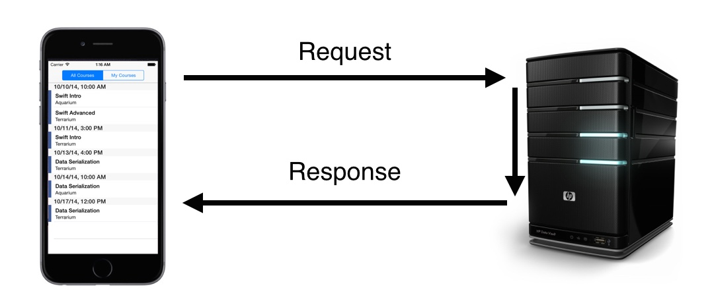
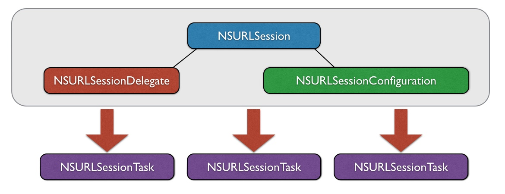
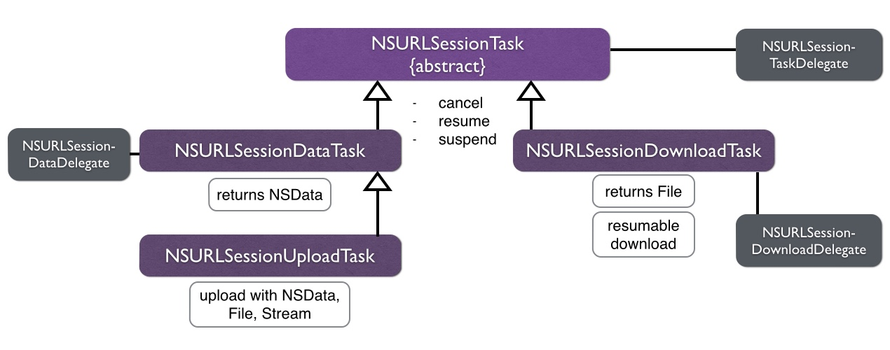
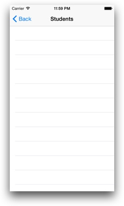
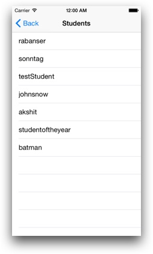
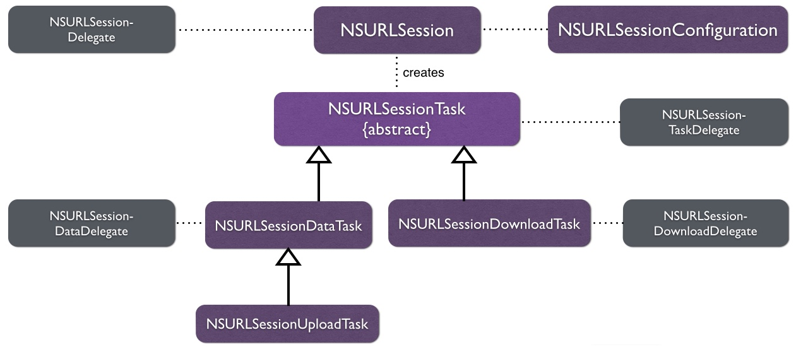
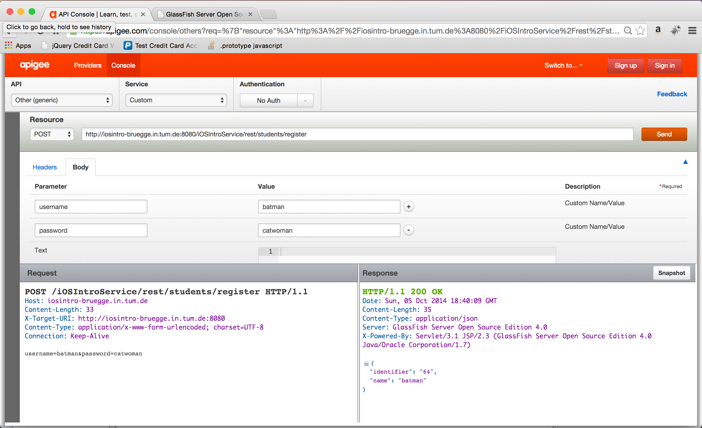

#Client-Server Communication

##Getting Started: What is Client-Server Communication?
When you're reading this tutorial you have learned so far how to build a basic iOS application. 
Anyway this app will be pretty alone on its iOS device in a world full of servers and other iPhones and iPads.
This tutorial shows you how to communicate with them.

To give you brief examples how Client-Server Communication is frequently used, just look for example at your Facebook app. 
To update the newsfeed on your phone you have to get the new stories from the Facebook servers first. 
When you update your status or upload a picture it has to be sent to the servers.

So you are going to implement this on the *Registration app* which was already introduced in the *Data Serialization* tutorial. 
Why is this even necessary?  
So far your registrations have been saved locally, but the conductors of the courses need to see who is registered. 
So the information that a student got registered has to be sent to a central server. 
Furthermore you want always the newest courses available. So it makes sense to refetch them from the server.  
So before you start please make sure that you have the *exercise.zip* file and unpack it. It contains the base project we already set up for you.

##Basic Terms
###Requests and Responses
Before you dive into the code there needs some theory to be clearified. The basic workflow of a Client-Server Communication is shown in the following picture:



The **client**, in our case the iPhone, sends a **request** to the **server**. The request can be in our Registration app: "Give me all the available courses I can register for". 
Then the server reacts to this request by putting the available courses in a certain data format (e.g. *JSON* or *XML*) into a **response** which is sent back to the **client**.  
It should be clear to you that a response can just be sent from the server after receiving a request from the client. 
That means the server can't just send something to the client in a Client-Server Communication workflow. 

Requests and responses have to follow a certain structure (according to the [*Request for Comments*](http://www.rfc-editor.org)). 

####Request
In a simplified way a request consists of a **request line**, **headers** and the **body data**.

|                   | HTTP Request                                            |
|-------------------|---------------------------------------------------------|
|    Request Line   |   GET http://iosintro-bruegge.in.tum.de:8080/students   |
|      Headers      | Accept: application/json; Content-Type: application/json |
| Message Body Data |                 our content, e.g. a JSON                |

The **request line** consists of the **HTTP command**, here ```GET``` (more about that later), and the **URL** the request is sent to.  
In the **header** you can specify information about the request, in our example we have set ```Accept: application/json``` and ```Content-Type: application/json```.  
The information in ```Content-Type``` specifies the content the request has in its **body data**, a *JSON* in our case. 
In the ```Accept``` header the request tells the server what kind of data it expects in the response, again a JSON here.

####Response
A **response** is structured similary. 

|                   | HTTP Response                                                                                                         |
|-------------------|-----------------------------------------------------------------------------------------------------------------------|
|    Status Line    |                                                    HTTP/1.1 200 OK                                                    |
|      Headers      |                Content-Type: application/json;  Date: Sat, 04 Oct 2014 09:38:25 GMT;  Content-Length: 571               |
| Message Body Data | ```[{„identifier“:“47“,"name":"rabanser","registrations": [{"courseTimeslot":"14","identifier":"51","student":"47"},...]``` |

It consists out of a **status line** (instead of the request line), a **header** and also the **body data**. The **status line** specifies the **protocol version** and the **status type**.  
In the example the **protocol** is HTTP in version 1.1 (what you probably will use most of the time) and the **status code** is *200 OK* which tells us that everything went fine. To learn more about status types, you can read the tutorial for *RESTful Services*.

###A typical URL
To make sure you know what we are talking about when you read this tutorial, here is a small overview of what a **URL** consists of. Consider this example URL:

```
http://iosintro-bruegge.in.tum.de:8080/iOSIntroService/rest/students?username=user&password=pw
```

Split up there are the following parts:

- Scheme: ```http```
- Domain: ```iosintro-bruegge.in.tum.de```
- Port: ```8080```
- Path: ```iOSIntroService/rest/students```
- Endpoint of our API: ```students```
- Query String: ```username=user&password=pw``` with the values ```user``` and ```pw``` for the keys ```username``` and ```password``` (can be used to hand over values to the server)

There was just a new term introduced: **API**.
It is an abbreviation for **Application Programming Interface**,  so it defines the inputs and outputs of a software component, which would be the *server* in our case.
So this **URL** is already part of the **API** you are going to use.  
Putting these parts together we get the following schema:

```
scheme://domain:port/path?query_string#fragment_id
```

Now let's try this in the browser.
Open [APIGEE](https://apigee.com/console/others) and copy the following URL into the *Resource* field.
```
http://iosintro-bruegge.in.tum.de:8080/iOSIntroService/rest/students
```
Now click on *Send* and you can see the request and the response.
E.g. in the response there is the status line ```HTTP/1.1 200 OK```, some headers like ```Date: Tue, 04 Nov 2014 21:30:54 GMT``` and the body data, which is a JSON filled with *Student* objects in our case.
**APIGEE** gives you an easy to use interface for examine requests and responses and even formats the body data in a easy-to-read way.
So you can test your requests before implementing them in your app.

##Requests in iOS
This tutorial covers two approaches for Client-Server Communication:

1. **NSURLSession** and its related classes: a framework provided by Apple
2. **AFNetworking**: an open source library

You will implement communication using both approaches in our demo app called Registration App.

You use the *Registration App* to register students into the intro courses of the iOS-Praktikum.
It is based on the app from the *Data Serialization* tutorial. 
This means you will use functions implemented in this tutorial to serialize data for requests and deserialize data you get back within responses.

###NSURLSession
The **NSURLSession** class and its related classes are provided by the Cocoa Framework which is included in every iOS project.
When you look at the class diagram below you can see that the **NSURLSession** class has a member of the class **NSURLSessionDelegate**, which can implement some delegate methods, and a member of the class **NSURLSessionConfiguration**.
The **NSURLSessionConfiguration** defines the behaviour of the requests sent.
The main goal is to create objects of the type **NSURLSessionTask**.



But as shown in the class diagram below **NSURLSessionTask** is just an abstract class, subclassed by **NSURLSessionDataTask**, **NSURLSessionUploadTask** and **NSURLSessionDownloadTask**.
All of them have the function ```resume``` (for starting the task), ```cancel``` (for canceling the task) and ```suspend``` (for suspending the task temporarily).
The **NSURLSessionDataTask** returns an **NSData** object (NSData is just a wrapper for byte buffers), while the **NSURLSessionUploadTask** allows you to upload an NSData object, a file or a stream.
Finally the **NSURLSessionDownloadTask** returns you a file and provides you resumable downloads.
So be careful: when you call ```suspend``` and then ```resume``` on a **NSURLSessionDataTask** the whole task will start all over again.

Additionally you can also implement some delegates. 



You don't have to get all the details of the **NSURLSession** API for this tutorial, so please don't feel overwhelmed.

Now please open the **RegistrationApp.xcodeproj** and run the app.
You can see a login screen where you can login with the following credentials:
- Username: *batman*
- Password: *catwoman*

#### Exercise 1.1

Click on **Students View** and you can see an empty table view.
The goal is fill this table view with the students who already registered themselves on the server.  


How it looks right now:



How it should look like:



Now go to the function 
```swift 
func updateStudents(success: (students:[Student]) -> Void, failure: (error : NSError!) -> Void)
```
in the ```DataManager.swift```.
We already implemented further failure and success handling, so you just have to call the the functions ```success``` and ```failure``` provided as parameters in ```updateStudents``` at the right time (error checking).
The URL to call is 
```
http://iosintro-bruegge.in.tum.de:8080/iOSIntroService/rest/students
```

In ```updateStudents``` write the following lines:
```swift
let configuration = NSURLSessionConfiguration.defaultSessionConfiguration()
configuration.HTTPAdditionalHeaders = ["Accept": "application/json", "Content-Type": "application/json"]
```
First you create an object of the type **NSURLSessionConfiguration** by calling the function ```defaultSessionConfiguration```. By setting the variable ```HTTPAdditionalHeaders``` you set the headers of your request.

Now create the session:
```swift
let session = NSURLSession(configuration: configuration, delegate: nil, delegateQueue: NSOperationQueue.mainQueue())
```
You just created an object of the type **NSURLSession**. As parameters it takes the **NSURLSessionConfiguration** object, and ```NSOperationQueue.mainQueue()``` for the **delegeteQueue**. In this queue the delegate calls and completion handlers are executed.

A short explanation what an **NSOperationQueue** is: it regulates the concurrent execution of operations.
By calling ```class func mainQueue() -> NSOperationQueue``` you get the default operation queue bound with the main thread.
The mainQueue is used because all UI operations are done on the main thread, including user input.  
This leads to the **Golden Rule of iOS Programming**:  

<div align="center"><b>Never Block The Main Thread</b></div>
</br>

If you block the main thread your app will look laggy and feel unresponsive, that should be avoided by all means.

To finish the initial setup create the **NSURL** object.
```swift
let url = NSURL(string: self.baseUrlString + "students")
```

An object of the type **NSURL** represents a URL. It is initialized with a string. You used the constant ```baseUrlString``` (which is already initialized in the project) concatenated with the string "students" (the endpoint).  

Now create the task.

```swift  
let task = session.dataTaskWithURL(url, completionHandler: { (data: NSData!, response: NSURLResponse!, error: NSError!) -> Void in

    if (error != nil) {
        failure(error: error)

    } else {
        let students = self.serializationHelper.studentsFromJSONData(data)
        success(students: students)
    }

})
```

Let's go through this code step by step. On your **NSURLSession** object you call the following function:

```swift
func dataTaskWithURL(_ url: NSURL,
completionHandler completionHandler: ((NSData!,
NSURLResponse!,
NSError!) -> Void)?) -> NSURLSessionDataTask
```

This function takes two parameters: an object of the type **NSURL** and a function serving as the ```completionHandler```. 
This ```completionHandler``` is executed when the request is done and provides three arguments. The *response data*, a *response object* and an *error object*.  
You implemented this function using a closure.  
What should always be done when a function has an error object as an argument: it should be checked if the error is not nil.
When there is an error, there should be decent error handling done. This is already implemented in the base project, so it's sufficient to call the ```failure``` function provided as an argument in the ```updateStudents``` function.
When there is no error the ```NSData``` object has to be deserialized. This has already been implemented in the *Data Serialization* tutorial, so you can just use the ```studentsFromJsonData``` function from the ```serializationHelper``` to get an array.
With this array the ```success``` function is called.  
When you are interested in what the ```failure``` and ```success``` functions are doing, check the ```updateStudents``` function in **StudentsViewController.swift**.

Anyway when you create a task, it's not doing anything. So you have to start it by calling the ```resume``` function.

```swift   
task.resume()
```

Now build and run the app again. You should see that the tableview in the **Students View** is filled with a lot of different students.

##REST
Before moving on you should be aware of the concept of **REST**. 
This section will give you just a short overview and when you need more detailed explanations, please have a look at the *RESTful Services* tutorial.
**REST** is an abbreviation for <b>Re</b>presentional <b>S</b>tate <b>T</b>ransfer and it is an architectural style for distributed hypermedia systems (like the internet).
REST provides a set of architectural constraints:
- **Client-Server**: user interface is separated from the data storage
- **Stateless Communication**: each request from the client to the server must contain all the information necessary to understand the request
- **Cacheable**: data within a response to a request must be implicitly or explicitly labeled as cacheable or non-cacheable
- **Uniform Interface**: implementations are decoupled from the service they provide by their interface
- **Layered System**: hierarchical layers are allowed

REST is using the standard **HTTP methods** as commands. Here a list with the most important ones.

| REST command (HTTP method) |                    Description                   | Operation |
|:--------------------------:|:------------------------------------------------:|:---------:|
|            POST            |             Create or add new entries            |   <b>C</b>reate  |
|             GET            | Read, retrieve, search, or view existing entries |    <b>R</b>ead   |
|        PUT or PATCH        |          Update or edit existing entries         |   <b>U</b>pdate  |
|           DELETE           |        Delete/deactivate existing entries        |   <b>D</b>elete  |

So think which REST command did you just implement in your request?
You retrieved all the available courses, so you just implemented a **GET** command. 
Think about when you want to register a new student on the server. 
Then you have to make a **POST** request, because you add a new entry (a student).

###AFNetworking
####Introduction
> AFNetworking is about getting what you want  

Matt Thompson, author of AFNetworking

This is a huge statement considering that the open source library **AFNetworking** is competing with an implementation by Apple.
The reason why **AFNetworking** is shown here is that is one of the most widely used iOS libraries and serves as a foundation for dozens of other projects and open source libraries.  
But the neat thing about **AFNetworking** is that it's built on top of **NSURLSession**.
That means that it is **compatible** with **NSURLSession**. The class **AFURLSessionManager** and its sublcass **AFHTTPSessionManager** manage the **NSURLSession** classes.  
Another advantage by **AFNetworking** it provides you with already implemented **serialization**. 
The classes implementing the **AFURLRequestSerialization** protocol encode parameters for a specified HTTP request. 
Accordingly the classes implementing the **AFURLResponseSerialization** protocol decode data into a more useful object representation, according to details in the server response.  
AFNetworking also supports you with **security** features. **AFSecurityPolicy** evaluates the server trust against pinned X.509 certificates (SSL certificates) and public keys.  
Furthermore the **AFNetworkReachabilityManager** monitors the **reachability** of domains and addresses for both WWAN and WiFi network interfaces. It can also notify you when the iPhone's connection to the internet changed, e.g. from WiFi to mobile network. This allows you to handle these cases decently.  
A last nice features are the **UIKit Extensions**, like **UIButton** and **UIImage**.  
This tutorial doesn't dive into these features in detail, when you are more interested in them, please check out [the official documentation](http://cocoadocs.org/docsets/AFNetworking/2.3.1/).

Let's step back to the first feature you saw about AFNetworking: it is built on top of NSURLSession. But how is that accomplished? 
Look at the class diagram of NSURLSession again.



There are a lot of different classes with their delegates. 
That can be pretty complicated.
So AFNetworking wraps up all the classes by implementing the delegates and creating the tasks. This is done by the class **AFURLSessionManager**. It is sublassed by **AFHTTPSessionManager** which provides you convenience functions for making HTTP requests. When you want to make a GET request, just call the function called ```GET```.


####Basic Setup
**AFNetworking** do require some basic setup to be done before you make an actual network request. 
So, let's get started with some initialization parts.

In ```DataManager.swift``` find ```init``` function and replace it with the following:

```swift
init(){
//1
let baseUrl = NSURL(string: baseUrlString)
manager = AFHTTPSessionManager(baseURL: baseUrl)

//2
manager.requestSerializer = AFJSONRequestSerializer()
manager.responseSerializer = AFJSONResponseSerializer()

//3
manager.requestSerializer.setValue("application/json", forHTTPHeaderField: "Accept")
manager.requestSerializer.setValue("application/json", forHTTPHeaderField: "Content-Type")

}
```

Let's go through these initialization parts step by step-

1. You first set up the ```baseUrl``` and then create an instance of **AFHTTPSessionManager**.
2. You then set session manager's *requestSerializer* and *responseSerializer* to the default JSON serializer. This way 
you tell to manager object that the request should be encoded with the JSON format and the response should be decoded with the JSON format. **AFNetworking** is smart enough to take care of parsing for you.
3. Now you set Header Fields ```Accept``` and ```Content-type``` to ```application/json```.

These steps follow a good practice of how you should set up AFNetworking.
Now, you are good to go for making network request using AFNetworking.


####Exercise 1.2 - GET Students
Now you will implement the previous Exercise 1.1 using AFNetworking. 
You will fetch a list of students using the convenience method ```GET``` provided by AFNetworking for executing a GET command.

Go to the ```updateStudents``` function in the ```DataManager.swift``` and comment out or delete the solution of Exercise 1.1.
At this point, you should be able to successfully build the app without any errors.

Now, in the ```updateStudents``` function itself, add the following lines of code:

```swift     
manager.GET(
    //1
    "students", 
    //2
    parameters: nil, 
    //3
    success: { (operation:NSURLSessionDataTask!, responseObject:AnyObject!) -> Void in

    }, 
    //4
    failure: { (operation:NSURLSessionDataTask!, error:NSError!) -> Void in

    }
)
```
You use the ```manager``` object you created before, and then you use the convenience method ```GET```. This method takes several parameters. 
Let's dissect them parameter by parameter.

1. *Endpoint specification*: It's of the type ```String``` and here you specify your API endpoint for the request. For this exercise, you use the *"students"* endpoint.
2. *Parameters*: Additional query string parameters that can be included along with your request. Servers often use them to let you filter the results of your request.
Here you specify nil parameters.
3. *Success Function*: Gets executed when the request was successfully finished. It has no return value and takes two arguments:
    - ```operation```: the data task class from **NSURLSession**
    - ```responseObject```: the result of the request, which is of type ```AnyObject```
4. *Failure Function*: Gets executed when the task finishes unsuccessfully. This can be the case when the status code of the response implies an error or AFNetworking encounters an error while parsing the response data. This block has no return value and takes two arguments: 
    - ```operation```: the data task
    - ```error```: describing the network or parsing error that occurred which is of type ```NSError```.

You have added the skeleton code for making a GET request in AFNetworking so far. You will now be handling the respone and failure of your request. Go ahead and add following lines code into the ```sucesss``` and ```failure``` functions.

```swift
manager.GET(
    "students", 
    parameters: nil, 
    success: { (operation:NSURLSessionDataTask!, responseObject:AnyObject!) -> Void in
        //1
        let studentsDict = responseObject as [Dictionary<String, AnyObject>]
        //2    
        let studentsArray = self.serializationHelper.studentsFromArrayOfDictionary(studentsDict)

        //3    
        success(students: studentsArray)
    },
    failure: { (operation:NSURLSessionDataTask!, error:NSError!) -> Void in
        //4
        failure(error: error)       
    }

)
```
Awesome, this is your first executable AFNetworking code! Let's go through it one section at a time.

1. You first cast the response as an array of dictionaries of the type ```<String, AnyObject>```.
2. You then use ```studentsFromArrayOfDictionary``` function from ```serializationhelper``` to get the array of students.
3. Now you call the ```success``` function with ```studentsArray``` as its parameter.
4. And finally you handle the failure case by calling the ```failure``` function with the ```error``` object as its parameter.

Now build and run the app again. You should see that the tableview in the **Students View** is filled with a lot of different students.

That's pretty neat: as you can see, AFNetworking is extremely simple to use. In just a few lines of code, you were able to implement a ```GET``` networking request that fetches the list of students.


####POST in APIGEE
Let's try making a POST request in the browser for registering a new student on the server.
1. Open [APIGEE](https://apigee.com/console/others) and copy the following URL into the *Resource* field.
```
http://iosintro-bruegge.in.tum.de:8080/iOSIntroService/rest/students/register
```
2. Now select POST from the dropdown list of REST methods. 
3. Then click on the Body and add following parameters and their values.
```
Parameter           Value
username            yourGreatUsername
password            catwoman
```
As you can guess already, these are the parameters added in your request and are in the form of **key-value** pairs. Choose your own username instead of ```yourGreatUsername```.

Now click on *Send* and you can see the request and the response as shown below.



As you can see, the response coming from the server specifies the *id* of the new student added. If you get a response "already registered" from the server then please choose a different username.

####Exercise 2 - POST Student
Now you will do the same POST request (you just did in the browser) using AFNetworking. You will register yourself as a student in the Intro Course. You will use the convenience method ```POST``` provided by AFNetworking for executing this REST command.

Go to the ```registerStudent``` function
```swift
func registerStudent(studentAttributes: Dictionary<String, String>,
success: (student:Student!) -> Void,
failure: (error : NSError!) -> Void)
```
in the ```DataManager.swift```.
As before, the success and failure handling have already been implemented. You just have to call the functions ```success``` and ```failure``` at right time with their respective parameters. The URL to call is 
```
http://iosintro-bruegge.in.tum.de:8080/iOSIntroService/rest/students/register
```

In ```registerStudent``` write the following lines:
```swift     
manager.POST(
    //1
    "students/register", 
    //2
    parameters: studentAttributes, 
    //3
    success: { (operation:NSURLSessionDataTask!, responseObject:AnyObject!) -> Void in

    }, 
    //4
    failure: { (operation:NSURLSessionDataTask!, error:NSError!) -> Void in

    }
)
```
This is the similar looking skeleton code you saw in the implementation of the ```GET``` function. Let's go through it once to reason out the differences.
1. *Endpoint specification*
2. *Parameters*: You specify the body data to be added. This has to be in form of **key-value** pairs as pointed out before. You use the ```studentAttributes``` object which is already passed for you in the ```registerStudent``` function. You can explore this by printing it out its value to the console.
**Important**: this is a big difference to the ```GET``` function. It puts the parameters into the query string, while the ```POST``` function puts it into the body data.
3. *Success Function*
4. *Failure Function* 

Next, you will be handling the success and failure cases of your request. Go ahead and add following lines code into the ```sucesss``` and ```failure``` functions.

```swift
manager.POST(
    "students/register", 
    parameters: studentAttributes, 
    success: { (operation:NSURLSessionDataTask!, responseObject:AnyObject!) -> Void in

        //Casting Response to a Dictionary object
        let studentDict = responseObject as Dictionary<String, AnyObject>

        //Deserialization to get student object
        self.student = self.serializationHelper.studentFromDictionary(studentDict)
         
        //Calling success function with student object
        success(student:self.student)

    },
    failure: { (operation:NSURLSessionDataTask!, error:NSError!) -> Void in
        //Calling failure function with error details
        failure(error: error)       
    }

)
```

Here, you can see it's fairly similar to the ```GET``` you did before but it is important to note the differences, mainly in respect to the ```parameters``` you provide to your request. For ````POST``` you specify the body data in the ```parameters``` field, while in the ```GET``` function you specify the query string parameters if any. 


So, thats how you do ```GET``` and ```POST``` requests in **AFNetworking**. The implementation is fairly simple and neat but yeah you have to get used to the syntax and the structure of these requests which in the beginning is bit confusing. But, after that things become straightforward and you will be able to cruise through like a champ.


###Authentication
Lastly, one more thing before we end this tutorial. It's about authenticating network request which is important for numerous security reasons. Below, you see two different ways to do authentication:

- **Query String**
```swift
let endpoint = “superheroes/register?” +
"username=\(self.superhero.username)"
"&password=\(self.superhero.password)"
```
Here you pass your authentication parameters i.e. *username* and *password* in the query strings. This is not a good way of doing it, but we were lazy implementing the server.

- **Header Field**
```swift
let endpoint = “superheroes/register”
manager.requestSerializer.setAuthorizationHeaderWithUsername("batman", password: "catwoman")
```
This code sets the "Authorization" HTTP header set in the request object using an **AFNetworking** function. This is also called *HTTP basic access authentication*.
This is a more sophisticated way of doing authentication.
Feel free to use more advanced ways during your iOS Praktikum, like **OAuth** or **OpenID**.

##Summary

You explored different ways of communication with a server. Apple provides us  **NSURLSession**, which is their new preferred method for communication. But it gets complicated when complex tasks have to be performed.

And the alternative to that is the widely used open source library, **AFNetworking**. There is big buzz about this library in the developer community for obvious reasons. We would recommend you to use this library in your iOS Praktikum as it makes life much easier when network operations turn ugly and complex. However, with this tutorial, you should be able to decide which technique is appropriate in a specific scenario.

##Where To Go From Here?
To understand the concepts of Client-Server Communication more, you can go through the *RESTful Services* tutorial.  
For using advanced techniques in **AFNetworking**, you can read [the documentation](http://cocoadocs.org/docsets/AFNetworking/2.3.1/). Unfortunately it is still written in Objective-C.
The [documentation for **NSURLSession**](https://developer.apple.com/library/IOs/documentation/Foundation/Reference/NSURLSession_class/index.html#//apple_ref/occ/cl/NSURLSession) is also quite helpful.
Anyway the makers of **AFNetworking** made a new networking framework with better syntax for *Swift*, called **Alamofire**. It's not as rich on features like AFNetworking (yet), but it is easier to integrate into your Swift projects and very convenient to write. Check out [the documentation](https://github.com/Alamofire/Alamofire).

## Credits

- [Akshit Malhotra](http://www.facebook.com/akshit.malhotra) - Masters Informatics
- Felix Sonntag - Bachelor Informatics

